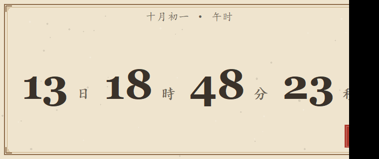
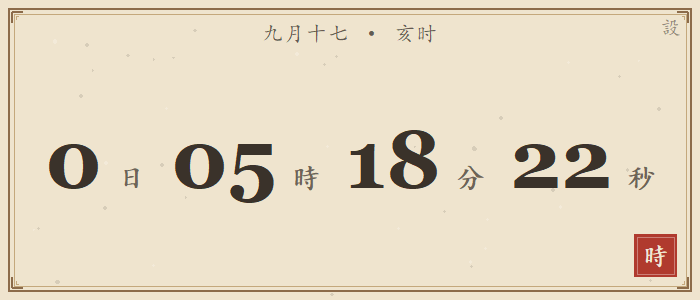

# 古风倒计时

一个常驻桌面的倒计时小工具。宣纸底、古铜框、朱砂印，剩余时间越少，颜色越紧迫。

纯 Python 标准库 + Tkinter 实现，**零第三方依赖**；`发布/` 目录里有打包好的单文件 exe，没有 Python 也能直接跑。

## 效果

| 常态 | 紧急 |
|---|---|
|  |  |
| **入夜** | **归零** |
|  |  |

更多截图见 `预览图/` 目录（设置面板、传书设置与寄出记录）。

## 功能特性

- **桌面挂件形态** —— 不占任务栏，默认置顶；可拖动、可 8 方向自由缩放，数字字号自动适配
- **任意分隔符的时间输入** —— `10.1`、`10月1日11:30`、`10-1 11:30`、`10 1 2 32` 都能认；只认数字，其它符号一律当间隔，写错了会明确告诉你错在哪
- **颜色随紧迫度变化** —— 4 档配色规则（竹青 → 琥珀 → 朱砂 → 入夜），最后 12 小时连底色一起换成墨黑；档位、颜色都能改
- **传书 · 邮件提醒** —— 剩余时间跨过档位时自动寄一封邮件；失败退避重试、关机期间错过的开机补寄、同档只寄一次
- **发信独立成进程** —— 主程序全程不加载 `smtplib`/`email`，加邮件提醒常驻占用零增加
- **极低占用** —— 实测 CPU 0.014%、内存约 38 MB、GPU 0%，每秒刷新仅 2.2 ms
- **单实例** —— 重复双击只会把已经开着的窗口拉回屏幕，不会多开

## 快速开始

### 打包版（推荐，免安装）

1. 下载 `发布/古风倒计时.exe`（约 11 MB）
2. 双击运行，窗口出现在屏幕右上方（首次启动慢两三秒是自解压，正常）
3. 双击窗口（或右键 → 设置）填目标时刻，例如 `10.1`

### 源码版

需要 Windows + Python 3.9 及以上：

- 双击 `启动倒计时.bat`，或命令行运行 `pythonw AncientCountdown.pyw`

### 重新打包 exe

```
python 打包.py
```

脚本把 PyInstaller 打包 → 冒烟测试 → 自检串成一条流水线，产物落在 `发布/` 目录。

## 目录结构

| 文件 | 说明 |
|---|---|
| `AncientCountdown.pyw` | 主程序 |
| `mailer.pyw` | 传书使者 —— 独立发信小程序，被主程序按需唤起，发完即退 |
| `启动倒计时.bat` | 源码版启动入口 |
| `自检.pyw` | 自检工具，排查问题时运行 |
| `打包.py` | 一键打包 exe（含冒烟测试与自检） |
| `使用说明.md` | 完整使用文档 |
| `发布/` | 打包产物：exe + 便携版使用说明 |

> 运行后程序旁边会生成 `countdown_config.json`（配置）、`notify_secret.json`（**邮箱授权码**）、
> `notify_state.json`（传书履历）。这三个是你的个人数据，已列入 `.gitignore` 不会进入仓库；
> 尤其授权码，别发给任何人。

## 平台

仅支持 Windows（使用了 Win32 互斥锁、GDI 绘制与输入法消息）。

## 完整文档

时间格式、颜色规则、窗口操作、传书设置、常见问题，见 [使用说明.md](使用说明.md)。
